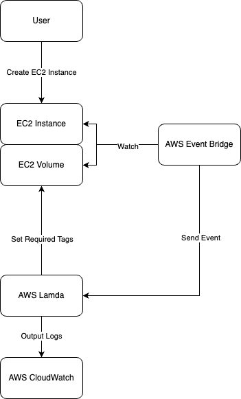

# Summary

This repo is used to add tags to EC2 instances and EBS volumes upon their creation.  It was mainly created to 
handle a case in ROSA where tags are not formally adjustable after initial provisioning of a cluster, yet 
operational environments must be able to adapt to changes like requirements for new tags, however it could be 
adopted to other use cases as well.

> **WARN:** this is not supported by Red Hat in any way.  Please use at your own risk.  This is simply a workaround 
> to allow for day 2 tagging when requirements change.

## Architecture

The following simplistically shows how this Terraform module achieves enforcement of desired tagging:

1. A user creates an EC2 instance
2. AWS Event Bridge rules are setup to send events when an EC2 instance is `Running` and when an EBS volume is `created`
3. An event is received by Lambda and a function (code in the `function/` directory) is executed.
4. The function performs logic to tag instances based on the `REQUIRED_TAGS_KEYS` and `REQUIRED_TAGS_VALUES` 
environment variables.
5. Logs are sent to a CloudWatch log group for review.

## Limitations

This was specifically created for ROSA (EC2 instances/volumes) but may be adopted to your use case without 
much work. As it pertains to ROSA, tags are typically controlled by a fleet management plane that SRE controls.  This 
means that **you may not modify managed tags and you may not delete managed tags**.  This is only for the purposes 
of **adding new tags!!!**.
